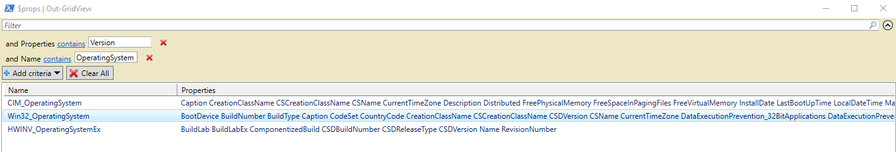

# Cmdlets to Scripts

## 3.1 System Management with WMI

1. Use the “Win32_BIOS” WMI class to list details of the BIOS on a list of  systems from a txt file (examine the syntax of the file):

    ```PowerShell
    Get-Content $env:SystemDrive\Labfiles\computers.txt  | Foreach-Object {Get-WmiObject -computername $_ win32_bios}
    ```

2. Now, use a WMI class to list details of Windows.  

    Format the output in a table containing the following details:

    | Machine Name | Operating System Version Number | Operating System Architecture | Installation Date|
    |--------------|---------------------------------|-------------------------------|------------------|
    |The table headings | should be listed above and the returned | data will be populated in these  | rows of the table|

    >**Note:** Use this script codeblock to help **FIND** the WMI class that contains the information we are looking for.

    ```PowerShell
    $allWMI = Get-WmiObject -List
    $props = ForEach ($wmi in $allWMI) {
        [pscustomobject]@{
            Name       = $wmi.name
            Properties = "$($wmi.properties.name)"
        }
    }
    $props | Out-GridView
    ```

    Now that we have a listing of WMI Objects in a gridview. How can we sort to determine an object that has the data we need?

    >**For Example:**
    

    ```PowerShell
    Get-WMIObject Win32_OperatingSystem | Format-Table PSComputerName, Version, OSArchitecture, InstallDate
    ```

3. How about converting property values displayed in DMTF to be human readable?

    In the last example, the WMI class **Win32_OperatingSystem** has a property called LastBootUpTime

    When using the **Get-WmiObject** the output of that property is not in a familiar time standard format.

    ```PowerShell
    (gwmi win32_OperatingSystem).lastbootuptime
    20200423212428.513878-240
    ```

    >How can we convert this to something more useful? Let's walk through this together

     PowerShell's object oriented language is built on top of .NET which also has a Class called **[ManagementDateTimeConverter]**
     within the **SystemManagement** namespace. Perhaps we can use this as a means to convert the time. *Let's Try!*

    ```PowerShell
    #First let's see what kind of Methods [ManagementDateTimeConverter] has available
    [System.Management.ManagementDateTimeConverter] | gm -s

    TypeName: System.Management.ManagementDateTimeConverter

    Name               MemberType Definition
    ----               ---------- ----------
    Equals             Method     static bool Equals(System.Object objA, System.Object objB)
    ReferenceEquals    Method     static bool ReferenceEquals(System.Object objA, System.Object objB)
    ToDateTime         Method     static datetime ToDateTime(string dmtfDate)
    ToDmtfDateTime     Method     static string ToDmtfDateTime(datetime date)
    ToDmtfTimeInterval Method     static string ToDmtfTimeInterval(timespan timespan)
    ToTimeSpan         Method     static timespan ToTimeSpan(string dmtfTimespan)

    ## Notice this has a ToDatetime static method. Let's see if we can use that!

    [System.Management.ManagementDateTimeConverter]::ToDateTime((gwmi win32_operatingsystem).lastbootuptime)
    Thursday, April 23, 2020 9:24:28 PM
    ```

    >**Viola!** We now know when the last time our machine powered on. Looks like this machine is due to reboot soon. Patch Tuesday!

## 3.2 Doing more with Get-Content

1. Often another data source will have information about a task we need to complete.

    One of those data sources is simply a text file. How can we read in the content of a file and then accomplish a task?

    Using **Get-Content** of course!

    The following example would most likely be run on a routine basis by Active Directory Admins.

    ```PowerShell
    $root = New-Object System.DirectoryServices.DirectoryEntry
    Get-content C:\labfiles\StaleComputers\StalePCs-<yourlogonname>.txt  | ForEach-Object { Move-ADObject -identity $_ -targetpath "OU=Stale,OU=PCs,OU=Production,$($root.distinguishedName)" }
    # Example
    $root = New-Object System.DirectoryServices.DirectoryEntry
    Get-Content C:\labfiles\StaleComputers\StalePCs-POSHUser-0.txt | ForEach-Object {Get-ADComputer $_ | Move-ADObject -TargetPath "OU=STALE,OU=PCs,OU=PRODUCTION,$($root.distinguishedName)”}
    ```

## 3.3 Other Kinds of Loops
