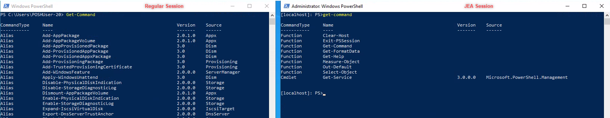
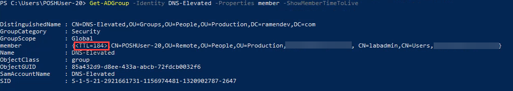
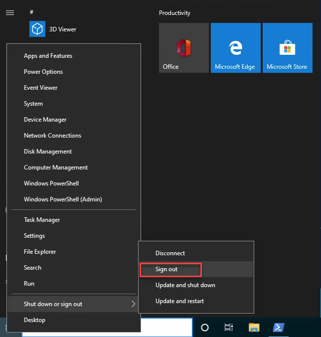

# Security

## Just Enough Administration

1. First lets create a PSSessionConfigurationFile using ISE

    ```PowerShell
    $params = @{
        Path = "$env:USERPROFILE\desktop\TestSession.pssc"
        SessionType = 'RestrictedRemoteServer'
        VisibleCmdlets = "Get-Service"
    }
    New-PSSessionConfigurationFile @params
    ```

    Open the newly created file on your desktop and review the contents. Notice in particular the **RunAsVirtualAccount**. This virtual account can be used in JEA and JIT configurations to enable privilege elevation.

2. Then register the SessionConfiguration file as an endpoint

    >**Note:** PowerShell session must be **Elevated**

    ```PowerShell
    Register-PSSessionConfiguration -Path "$env:USERPROFILE\desktop\TestSession.pssc" -Name ($env:USERNAME + 'test')
    ```

3. Now connect to the session

    ```PowerShell
    Restart-Service WinRM
    $session = New-PSSession -ComputerName localhost -ConfigurationName ($env:USERNAME + 'test')
    Enter-PSSession -Session $session
    ```

4. Finally compare the JEA session commands compared to a normal PowerShell session.

    Open another PowerShell host and run:

    ```PowerShell
    Get-Command
    ```

    Then run in the JEA session

    ```PowerShell
    Get-Command
    ```

    For example:

    

    Notice the difference in the number of commands that are available

5. Cleanup the session configuration information

    ```PowerShell
    Unregister-PSSessionConfiguration -Name ($env:USERNAME + 'test')
    ```

    And verify the endpoint no longer exists

    ```PowerShell
    Get-PSSessionConfiguration -Name ($env:USERNAME + 'test') # Should result in an error
    ```

## Just In Time

For this section we will be working with a previously configured PSsessionConfigurationFile as well as a defined PS role capability. The outcome of this demonstration will be to show how a DNS administrator can manage all aspects of DNS even when the DNS role is running on a **Domain Controller**

1. First attempt to RDP to the Domain Controller.

    >**Note:** You can obtain this information from the PowerShell Environment variables

    ```PowerShell
    mstsc /v ($env:LOGONSERVER).Split('\')[2]
    ```

    This will result in an access denied error due to not being a **Domain Admin**

    **Let's** look at another example.

    Using the DNS RSAT tools, run the following:

    ```PowerShell
    Get-DnsServer -ComputerName ($env:LOGONSERVER).Split('\')[2]
    ```

    >**Note:** This should result in an error, specifically **PermissionDenied**

2. Now elevate you privileges using Active Directory Privileged Access Managment:

    ```PowerShell
    Add-ADGroupMember -Identity DNS-Elevated -Members $env:username -MemberTimeToLive ([timespan]"01:00")
    ```

    >**Note:** This command is adding you to the AD Group **DNS-Elevated** with a TTL of 5 Minutes

3. View the TTL for your user account

    ```PowerShell
    Get-ADGroup -Identity DNS-Elevated -Properties member -ShowMemberTimeToLive
    ```

    For example:

    

    Notice the TTL number. After this timer reaches 0, AD will remove the person from the group effectively removing their DNS Admin privileges.

4. **IMPORTANT** Logoff your workstation and log back in to refresh group memebership

    

5. Now that we have given ourselves some rights, lets try again to connect to the Domain Controller to manage DNS.

    ```PowerShell
    $dnsAdmin = New-PSSession -ComputerName ($env:LOGONSERVER).Split('\')[2] -ConfigurationName DnsAdmin
    ```

    Then use the new session to enter a PSSession

    ```PowerShell
    Enter-PSSession -Session $dnsAdmin
    ```

6. Then, test administration using a **Get** command:

    ```PowerShell
    Get-DnsServer
    ```

7. Cleanup Session

    ```PowerShell
    exit
    Remove-PSSession $dnsAdmin
    ```

## Constrained Language Mode

In this final section lets take a look at some of the capabilities of constrained language mode. It is worth pausing here to recognize that the contrained language mode is designed to work with application whitelisting versus working in conjunction with JIT and JEA.

1. Open a PowerShell session and view the current language mode

    >Expected setting is **FullLanguage**

    ```PowerShell
    $ExecutionContext.SessionState.LanguageMode
    ```

2. While still in full language mode execute:

    ```PowerShell
    Add-Type -AssemblyName system.web
    ```

    Notice there is nothing returned, but we can explore some of the members available to us within this class

    ```PowerShell
    [System.Web.Security.Membership] | gm -s
    ```

3. Now transition to ContrainedLanguage Mode:

    ```PowerShell
    $ExecutionContext.SessionState.LanguageMode = "ConstrainedLanguage"
    ```

    Attempt to add a .Net Class

    ```PowerShell
    Add-Type -AssemblyName system.web
    ```

    As you can see it gives an error.

    Let's try one more

    ```PowerShell
    [math]::Round(1.2)
    ```

    Notice the error shows that the **method** cannot be used in this language mode.
